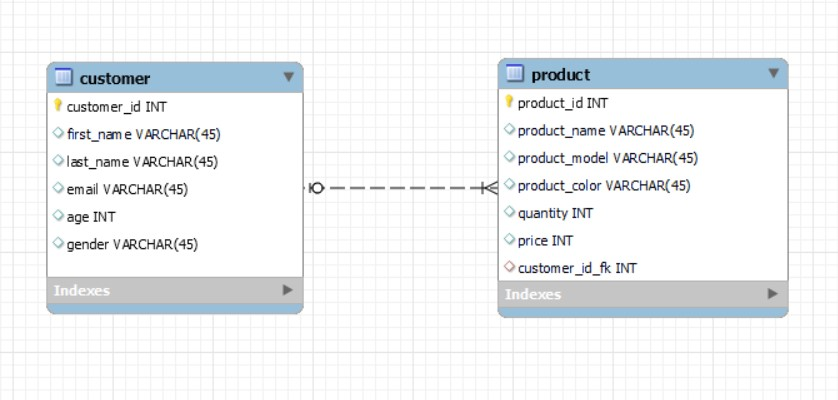

# Spring Boot, MySQL, JPA, Rest API

Build REST CRUD API for a Customer-Product using Spring Boot, MySql, JPA and Hibernate.

## About application

This application consists of a composition of Customer-Product, the relationship between which is "one to many".
<br/>The customer consists of the following information: first name, last name, email, age, gender, list of products.
<br/>The product consists of the following information: product name, product model, color, quantity and price.

## Requirements

- Java JDK 17
- Apache Maven >= 3.6.3 (Optional)
- MySql 8

## Steps to Setup

**1. Clone the application**

```bash
git clone https://github.com/Kenor007/Spring-Boot-Customer-REST-API.git
```

**2. Create Mysql database**

```bash
create database customer_db
```

- run `src/main/resources/customer.sql`

**3. Change mysql username and password as per your installation**

+ open `src/main/resources/application.properties`
+ change `spring.datasource.username` and `spring.datasource.password` as per your mysql installation

**4. Run the app using maven**

```bash
mvn package
java -jar target/Customer-0.0.1-SNAPSHOT.jar
```

Alternatively, you can run the app without packaging it using -

```bash
mvn spring-boot:run
```

The app will start running at <http://localhost:9090>

## Explore Rest APIs

The app defines following CRUD APIs.

### Customers

| Method | Url                | Description                                          | Sample Valid Request Body |
|--------|--------------------|------------------------------------------------------|---------------------------|
| GET    | /customers         | Get all customers                                    |                           |
| GET    | /customers/{id}    | Get customer by id                                   |                           |
| POST   | /customers         | Add customer                                         | [JSON](#customercreate)   |
| PUT    | /customers/{id}    | Update customer by id                                | [JSON](#customerupdate)   |
| DELETE | /customers/{id}    | Delete customer by id                                |                           |
| GET    | /customers/getInfo | Get join information <br/>from customer and products |                           |

### Products

| Method | Url                | Description                                          | Sample Valid Request Body |
|--------|--------------------|------------------------------------------------------|---------------------------|
| GET    | /products          | Get all products                                     |                           |
| GET    | /products/{id}     | Get product by id                                    |                           |
| POST   | /products          | Add product                                          | [JSON](#productcreate)    |
| PUT    | /products/{id}     | Update product by id                                 | [JSON](#productupdate)    |
| DELETE | /products/{id}     | Delete product by id)                                |                           |

Test them using Postman or any other rest client.

## Sample Valid JSON Request Bodys

##### <a id="customercreate">Create Customer -> /customers</a>

```json
{
  "customer": {
    "firstName": "Mikle",
    "lastName": "Nikola",
    "email": "mik@gmail.com",
    "age": 32,
    "gender": "male",
    "products": [
      {
        "productName": "Mobile Phone",
        "productModel": "Asus",
        "color": "Black",
        "quantity": 1,
        "price": 250
      },
      {
        "productName": "Laptop",
        "productModel": "Asus",
        "color": "Grey",
        "quantity": 2,
        "price": 1100
      }
    ]
  }
}
```

##### <a id="customerupdate">Update Customer -> /customers/{id}</a>

```json
{
  "customer": {
    "firstName": "Vanya",
    "lastName": "Odinets",
    "email": "ivan7@gmail.com",
    "age": 33,
    "gender": "male",
    "products": [
      {
        "productName": "Mobile Phone",
        "productModel": "Apple",
        "color": "Grey",
        "quantity": 1,
        "price": 1000
      },
      {
        "productName": "Car",
        "productModel": "Nissan",
        "color": "Silver",
        "quantity": 1,
        "price": 11000
      }
    ]
  }
}
```

##### <a id="productcreate">Create Product -> /products</a>

```json
{
  "productName": "TV Set",
  "productModel": "LG",
  "color": "Black",
  "quantity": 1,
  "price": 50
}
```

##### <a id="productupdate">Update Product -> /products/{id}</a>

```json
{
  "productName": "Mobile Phone",
  "productModel": "LG",
  "color": "Black",
  "quantity": 1,
  "price": 500
}
```

Postman Collections:
[colection](src/main/resources/Customer-product.postman_collection.json)

## Model ER

<br><br>